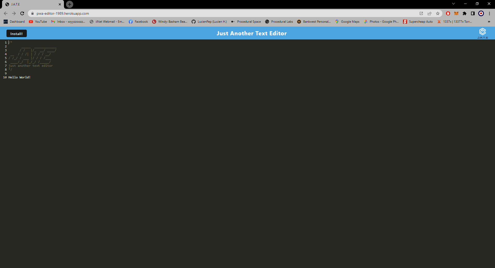

# Homework-Week-19
## PWA-Text-and-Note-Editor 

 My task was to build a text editor that runs in the browser. The app is a single-page application that meets the PWA criteria. Additionally, it features a number of data persistence techniques that serve as redundancy in case one of the options is not supported by the browser. The application also functions offline.

### User Story
```
AS A developer
I WANT to create notes or code snippets with or without an internet connection
SO THAT I can reliably retrieve them for later use
```

### Table of Contents
1. [Acceptance Criteria](#acceptance-criteria)
2. [Work Description](#work-description)
3. [Deployed Site Link](#link-to-deployed-site)
4. [Screenshot](#screenshot)
5. [Installation](#installation)
6. [Usage](#usage)
7. [License](#license)
8. [Questions](#questions)

### Acceptance Criteria
```
GIVEN a text editor web application
WHEN I open my application in my editor
THEN I should see a client server folder structure
WHEN I run `npm run start` from the root directory
THEN I find that my application should start up the backend and serve the client
WHEN I run the text editor application from my terminal
THEN I find that my JavaScript files have been bundled using webpack
WHEN I run my webpack plugins
THEN I find that I have a generated HTML file, service worker, and a manifest file
WHEN I use next-gen JavaScript in my application
THEN I find that the text editor still functions in the browser without errors
WHEN I open the text editor
THEN I find that IndexedDB has immediately created a database storage
WHEN I enter content and subsequently click off of the DOM window
THEN I find that the content in the text editor has been saved with IndexedDB
WHEN I reopen the text editor after closing it
THEN I find that the content in the text editor has been retrieved from our IndexedDB
WHEN I click on the Install button
THEN I download my web application as an icon on my desktop
WHEN I load my web application
THEN I should have a registered service worker using workbox
WHEN I register a service worker
THEN I should have my static assets pre cached upon loading along with subsequent pages and static assets
WHEN I deploy to Heroku
THEN I should have proper build scripts for a webpack application
```

---
[](https://opensource.org/licenses/MIT)

### Work Description
I Started by writing the modules and scripts used inside the webpack.config.js. I next created teh manifest creator and added the GetAll and Put method in the database.js. I added the PWA install commands when the install button is clicked on the main page inside the install.js. I then npm run start to create the dist file and confirmed the js files have been successfully bundled and all other files had been added correctly. I used the Lighthouse add on in Chrome to check how compatible this website was for PWA downloading. When I added data into the text editor nothing was saving after some debugging and talking with the lecturer the problem was found inside the database.js Put method. I was adding the data with a name where I just needed to add the data by it's self, once this was found the application function runs with no errors. I then deployed it to Heroku and did one last final check of all PWA functionality.

### Link To Deployed Site

[Week-19-Heroku-Deployment](https://pwa-editor-1989.herokuapp.com/)

### Screenshot



### Installation

For this application no dependencies need to be installed as a user on the deployed application.

### Usage

This project is deployed using Heroku [here](https://pwa-editor-1989.herokuapp.com/).

You can create notes and edit previous notes easily and download this application to your computer and run this application offline or offline.

### License

The license I am using for my project is<br>[MIT](https://opensource.org/licenses/MIT)

### Questions

GitHub: [Lucienpep](https://github.com/Lucienpep)<br>

For any further questions contact me via:

Email: <xxyyzzoozz@gmail.com>

---
Lucien Haines UADL 2023